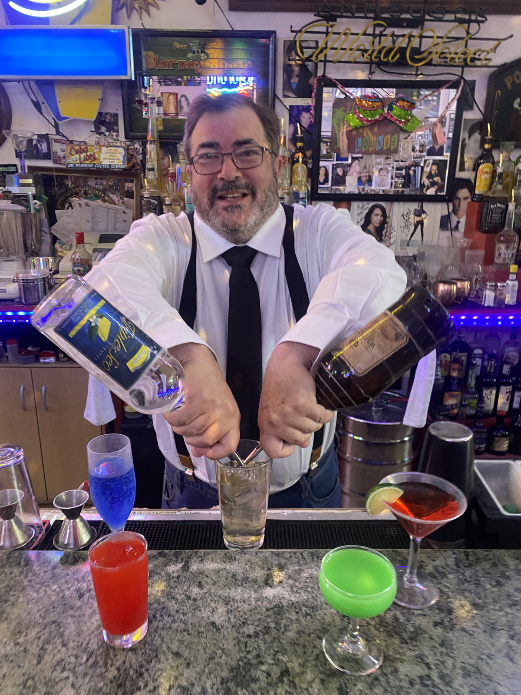

## BARTENDER

{width=2in}

### Bartending Summary

Bartender and hospitality professional with experience in high-volume performing-arts venues at the Los Angeles Music Center. Experienced in complete bar setup and breakdown, guest service, concentrated intermission rushes, preparation of classic cocktails, beverage service, and maintaining an organized workstation under time pressure.

## Bartending Experience

### Bartender — Patina Restaurant Group
**Los Angeles Music Center, Los Angeles, CA — April 24, 2018–approximately July 23, 2019**

- Worked as a bartender supporting performances and events at major Los Angeles Music Center venues.
- Set up complete working bars from scratch before service.
- Served large numbers of theater and concert patrons during concentrated intermission rushes.
- Prepared classic mixed drinks including martinis, Manhattans, White Russians, and other standard cocktails.
- Provided direct guest service in a fast-paced performing-arts hospitality environment.
- Maintained an organized and functional bar throughout service.
- Completely broke down and cleaned the bar after service.

### Venues

- Dorothy Chandler Pavilion
- Ahmanson Theatre
- Walt Disney Concert Hall

## Related Customer-Service Experience

### ArcLight Cinemas
**Los Angeles, CA**

- Worked in multiple customer-facing functions including ticket sales, concessions, ushering, and guest greeting.
- Assisted large numbers of patrons in a busy entertainment environment.
- Worked as part of a coordinated front-of-house team.

## Bartending & Hospitality Skills

Full bar setup, bar breakdown, high-volume service, intermission service, guest interaction, classic cocktails, martinis, Manhattans, White Russians, beverage service, workstation organization, hospitality, customer service, entertainment-venue service, teamwork, and communication.

## Education & Training

**Bartenders Training Institute — 2018**  
Bartender Training Program — Certificate

**Oberlin College** — Bachelor of Arts, Russian/Soviet Studies

<!-- selective-generation workflow test -->